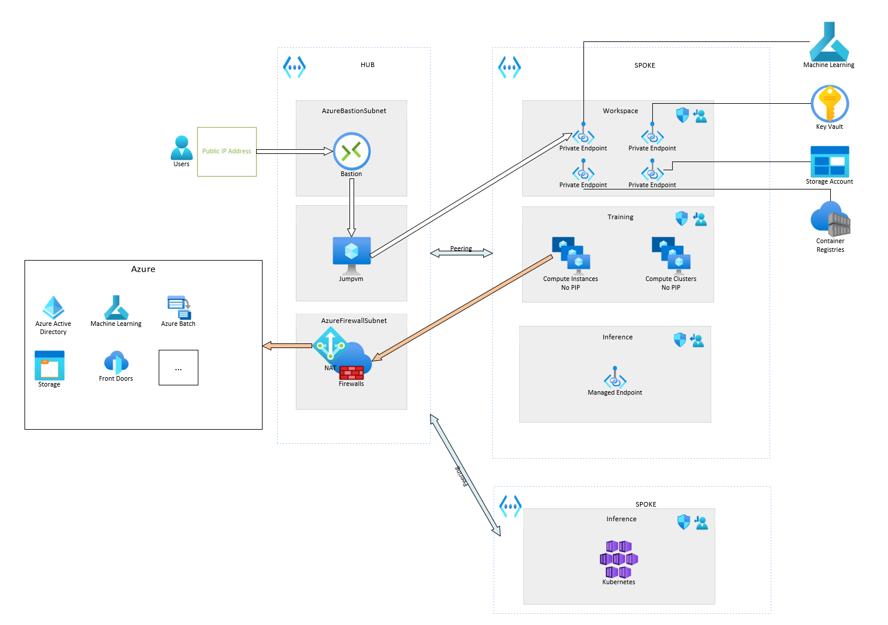

# aml-secure-terraform

## Motivation

Right now, terraform official documentation only covers [an example of secured workspace](https://github.com/Azure/terraform/tree/master/quickstart/301-machine-learning-hub-spoke-secure), without secured training computes, and without secured inference. Examples on how to properly secure the ml extension on AKS are also non existent for now.

This repo was made to demonstrate :
- A hub & spoke toplogy
- secure workspace
- secure training computes (no public IP compute)
- secure inference : dedicated AKS spoke & no public IP to aml extension

## How to

This was made to be as easy as possible to deploy.
1. Feel free to edit variable defaults in variables.tf or to create your own tfvars
1. az login
1. if required: az account set --subscription
1. terraform init
1. terraform apply

If you are not interested by the AKS part, you can just delete the reference to the module in the main.tf line 42 to 53.

## How to improve

This example was made fully in terraform to limit the amount of tool required.
For a production deployment, you might consider the following change :
- Leverage CICD pipeline with a service principal to run terraform
- Use Gitops methodology to manage AKS internals instead of doing it like I did through kubernetes provider
- Improving AKS security even more (RBAC authentication, TLS, etc). I chose not to add those because I wanted for the code to remain as simple as possible while focusing on the AML side.

## Additionnal documentation

Here is some additionnal content that might interest you :
- [No public IP training compute - network explained](./docs/nopipcompute.md)
- Inferencing Environment 
    - [Secure Managed Endpoint explained](./docs/managedendpoint.md)
    - [Secure mlextension on AKS explained](./docs/aks.md)
- [How to use afterwards - step by step of a model deployment to aks](./docs/howtouse.md)
- [Troubleshooting](./docs/troubleshooting.md)